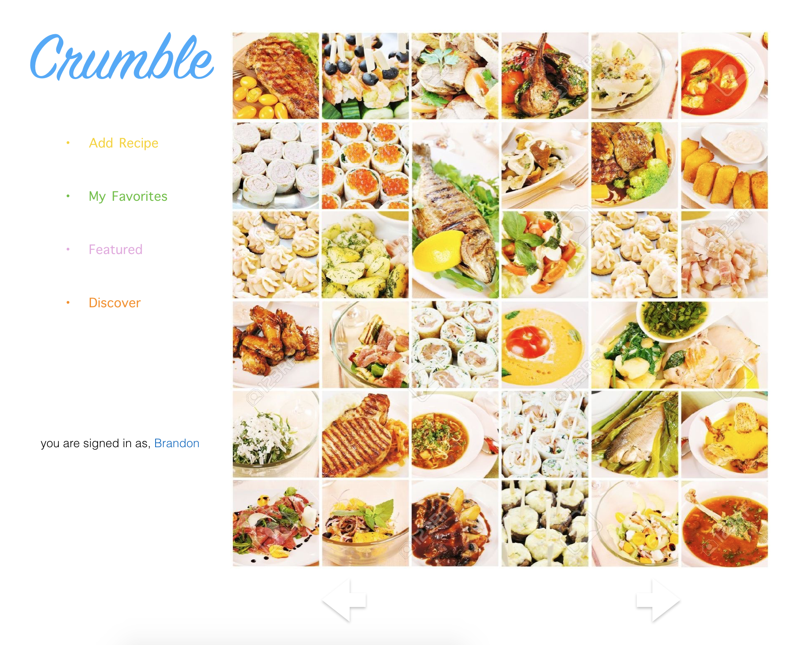

#Crumblr

This is app is a platform for users to post recipes they've made or found and share them with fellow users in a Tumblr feed. 

I would eventually like to add a clickable map, that sorts recipes by cuisine. Upon clicking a country, the app with recomend a random recipes from that cuisine ID. 

##Technologies Used
MEAN Stack, JS, CSS, HTML, Heroku, Git, Bootstrap.

#Wireframes
## Login Page

## Home Page

## Recipe Page

##User Stories

As a User I can...

1. Signup 		('/signup')
2. Login 			('/login')
3. Add Recipe		('/addrecipe')
4. Browse Posts  ('/recipes')
5. Explore new   ('/featured')

